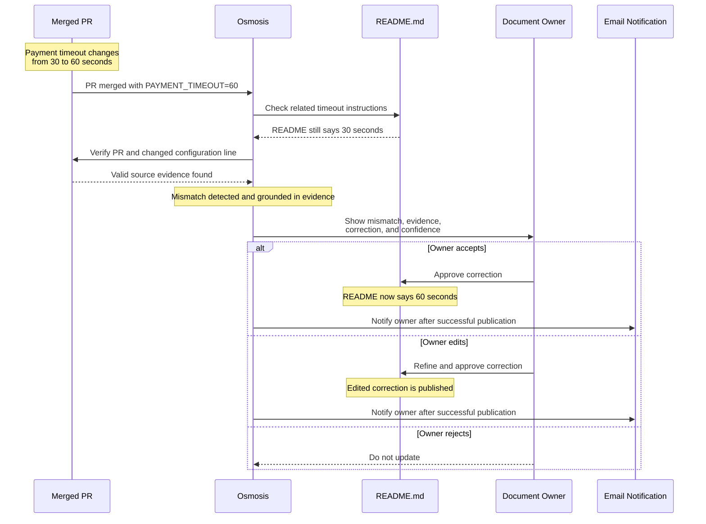
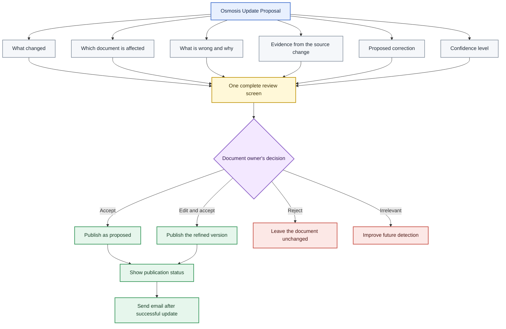
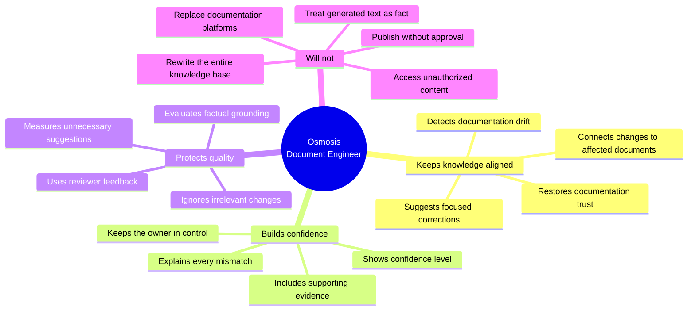

# Osmosis Document Engineer

> **Status:** Draft  
> **Project type:** Developer productivity and knowledge automation  
> **Initial scope:** One GitHub repository, merged pull requests, Markdown/README documentation, and a human review UI  
> **Future scope:** Confluence, SharePoint, API documentation, runbooks, release notes, and additional repositories

---

## 1. Product Summary

**Osmosis Document Engineer** is an AI-assisted document engineer that keeps engineering documentation synchronized with the systems it describes.

**Osmosis does not generate documentation from scratch. It detects when existing documentation becomes wrong because engineering changed.**

It listens for meaningful engineering events such as merged pull requests, releases, API contract changes, and configuration updates. It analyzes what changed, identifies the documentation that may be affected, checks whether that documentation is now outdated, and generates an evidence-backed update proposal.

Every proposal clearly communicates:

- What changed
- Which document is affected
- Why the existing content may now be outdated
- The source evidence behind the finding
- The suggested correction
- A confidence level

Document owners remain in control. They can review, edit, approve, reject, or mark a suggestion as irrelevant before anything is published. Reviewer decisions and an evaluation harness help improve impact detection and draft quality over time.

The product's unique value is not simply AI-generated writing. It is the ability to connect a **specific engineering change** to the **specific documentation affected by that change**.

---

## 2. Problem

Engineering systems change faster than their documentation.

When developers update code, configuration, APIs, deployment processes, or service behavior, the related documentation is often not updated at the same time. Over time, this creates documentation drift across:

- README files
- Confluence pages
- SharePoint documents
- API documentation
- Deployment guides
- Operational runbooks
- Release notes

Documentation drift leads to:

- Incorrect setup instructions
- Broken or outdated commands
- Missing configuration details
- Incorrect API behavior descriptions
- Unreliable deployment procedures
- Wasted time validating whether documentation can be trusted
- Increased dependency on tribal knowledge

The core problem is not a lack of documentation. It is the lack of a reliable connection between **system changes** and the **knowledge that describes those systems**.

---

## 3. Product Goal

Keep engineering documentation aligned with the systems it describes by detecting when a meaningful change makes existing documentation outdated and proposing a focused, evidence-backed correction for human approval.

### Product principles

1. **Detect drift early**  
   Identify documentation mismatches soon after the source change occurs.

2. **Connect changes to the right documents**  
   Avoid forcing people to manually search for every page or guide that may be affected.

3. **Explain rather than merely generate**  
   Every suggestion must show why the update is required and where the evidence came from.

4. **Make evidence mandatory**  
   Every suggestion must cite valid source evidence. **No evidence means no suggested update.**

5. **Keep humans in control**  
   No proposed change is published without explicit review and approval.

6. **Prefer precision over volume**  
   A small number of useful suggestions is more valuable than many noisy or irrelevant ones.

7. **Improve through explicit feedback**  
   Accepted, edited, rejected, and irrelevant suggestions should improve future results in a transparent and measurable way.

---

## 4. Proposed Solution

When an engineering change occurs, Osmosis will:

1. Understand what changed.
2. Find documentation connected to that change.
3. Determine whether the change affects documented behavior or instructions.
4. Ignore changes that do not require documentation updates.
5. Identify and explain any mismatch with supporting evidence.
6. Stop without creating a suggestion if valid evidence is unavailable.
7. Draft a focused correction.
8. Send the proposal to the responsible document owner.
9. Publish only after approval.
10. Notify the document owner by email after the approved update is successfully published.
11. Use the review decision to evaluate and improve future suggestions.

### Osmosis operating loop

```mermaid
flowchart LR
    A["1. Pull request is merged"] --> B["2. Understand the change"]
    B --> C["3. Find related documentation"]
    C --> D{"4. Is the documentation<br/>actually affected?"}

    D -->|"No"| E["Ignore the change"]
    D -->|"Yes"| F["5. Identify the mismatch"]
    F --> G{"6. Is valid evidence available?"}
    G -->|"No"| N["Do not create a suggestion"]
    G -->|"Yes"| H["7. Create an evidence-backed update"]
    H --> I["8. Send it to the document owner"]

    I --> J{"9. Owner decides"}
    J -->|"Accept"| K["Publish the correction"]
    J -->|"Edit"| L["Refine and publish"]
    J -->|"Reject"| M["Do not publish"]
    K --> O["10. Send email notification"]
    L --> O
    O --> P["11. Learn from the decision"]
    M --> P
    P --> B

    classDef event fill:#FFF4E5,stroke:#D88A20,color:#3B280B,stroke-width:2px
    classDef intelligence fill:#E8F0FE,stroke:#4C78D0,color:#14284A,stroke-width:2px
    classDef decision fill:#FFF8D8,stroke:#C49A17,color:#3F3208,stroke-width:2px
    classDef human fill:#F3E8FF,stroke:#8B5FC7,color:#32184F,stroke-width:2px
    classDef publish fill:#E6F6EC,stroke:#3E9B61,color:#153D24,stroke-width:2px
    classDef stop fill:#FCE8E6,stroke:#C9574D,color:#4D1713,stroke-width:2px

    class A event
    class B,C,F,H,P intelligence
    class D,G,J decision
    class I human
    class K,L,O publish
    class E,M,N stop
```



---

## 5. Initial User Scenario

A merged pull request changes the payment timeout configuration from:

```text
PAYMENT_TIMEOUT=30
```

to:

```text
PAYMENT_TIMEOUT=60
```

However, the repository's `README.md` still states that the payment timeout is 30 seconds.

Osmosis detects the mismatch and creates a proposal:

> The payment timeout changed from 30 to 60 seconds in merged PR #482. The `README.md` still uses the previous value. Evidence: PR #482 and the changed configuration line `PAYMENT_TIMEOUT=60`. Suggested update: replace 30 seconds with 60 seconds.

The document owner can accept the proposal, edit it before accepting, reject it, or mark it as irrelevant. After an approved correction is successfully published, Osmosis sends the owner an email notification.

### Example experience



---

## 6. How Osmosis Knows Something Changed

Osmosis does not repeatedly read or crawl every connected system. It responds to meaningful events generated by engineering workflows.

For example:

1. A pull request is merged.
2. Osmosis receives the change event.
3. It reads the changed files and the context describing the change.
4. It identifies documentation connected to the affected area.
5. It checks whether the documentation is meaningfully impacted.
6. It creates an update proposal when a mismatch is found.

Potential triggers include:

- A pull request being merged
- A new software release
- An API contract changing
- A configuration value changing
- A service being renamed
- A deployment process changing
- A GitHub issue being resolved

The system should focus on meaningful behavioral or operational changes. Formatting updates, test cleanup, comments, and internal refactoring should be ignored when they do not change anything users need to understand or do.

---

## 7. Documentation Relationships

Osmosis needs to understand which documents describe which parts of an engineering system.

For example:

```text
payment-service/
    -> README.md
    -> docs/payment-api.md
    -> docs/deployment.md
```

These relationships help Osmosis narrow its search and determine which documents are reasonable candidates for impact analysis.

A relationship may be established through explicit ownership, links, repository structure, references, historical updates, or other reliable signals. The MVP should prefer clear, controlled, repository-local relationships over attempting to understand an entire company knowledge base.

---

## 8. Evidence-Backed Update Proposal

An Osmosis proposal must be understandable and reviewable without asking the document owner to repeat the investigation. Evidence is a hard requirement: if Osmosis cannot identify valid source evidence for a mismatch, it must not generate an update proposal. **No evidence means no suggested update.**

Each proposal should include:

- **What changed:** A concise description of the engineering change
- **Affected document:** The specific document and relevant section
- **Detected mismatch:** The content that may now be outdated
- **Reason:** Why the engineering change affects that content
- **Evidence:** The supporting pull request, commit, configuration, or code reference
- **Suggested correction:** A focused proposed edit
- **Confidence level:** Osmosis's confidence that the document requires this update

### What the document owner sees

The following information and actions should appear together in one clear review screen.



---

## 9. Review and Approval Workflow

The document owner can:

- **Accept:** Publish the correction as proposed
- **Edit and accept:** Refine the wording before publication
- **Reject:** Decline the proposed update
- **Mark as irrelevant:** Indicate that the detected relationship or impact was not useful

No document should be changed automatically in the initial product experience. Human approval is a core product requirement, not merely a temporary safeguard.

The review screen must show the publication status. After an approved correction is successfully published, Osmosis sends an email notification to the relevant document owner with the affected document and publication result.

Reviewer feedback must be used carefully and transparently. Osmosis should learn from explicit decisions, but it must not silently infer preferences from private reviewer behavior.

---

## 10. Evaluation Harness

The evaluation harness determines whether Osmosis is producing useful, grounded, and appropriately targeted suggestions.

It should measure whether the system:

- Found the correct document
- Identified the correct section
- Correctly recognized outdated content
- Ignored changes that did not require documentation updates
- Avoided unnecessary suggestions
- Produced a factually grounded correction
- Included valid and sufficient evidence
- Improved after explicit reviewer feedback

The purpose of evaluation is not simply to measure writing quality. It is to verify the complete chain from change detection to document selection, mismatch identification, evidence quality, and reviewer usefulness.

---

## 11. Core Product Capabilities

### 11.1 Change understanding

Understand the meaningful effect of a code, configuration, API, release, or process change.

### 11.2 Documentation mapping

Maintain relationships between engineering areas and the documentation that describes them.

### 11.3 Impact analysis

Determine whether an engineering change actually requires a documentation update.

### 11.4 Mismatch detection

Locate the exact statement, instruction, command, value, or section that may now be incorrect.

### 11.5 Update generation

Create a focused proposed edit grounded in the source change.

### 11.6 Evidence presentation

Show enough supporting context for the owner to understand and verify the proposal. If valid evidence is unavailable, do not create the proposal.

### 11.7 Human review

Allow the responsible owner to accept, modify, reject, or mark a proposal as irrelevant.

### 11.8 Controlled publication

Publish only after approval, either by updating the selected document or by raising a documentation change for review.

### 11.9 Publication notification

Notify the relevant document owner by email after an approved update is successfully published.

### 11.10 Continuous evaluation

Measure quality and use explicit review outcomes to improve future detection and drafting.

---

## 12. MVP Scope

The first version should support only:

- One GitHub repository
- Markdown and README files stored in that repository
- Merged pull requests as the trigger
- Documentation relationship mapping
- Documentation impact detection
- Mismatch identification
- Evidence-backed draft generation
- A clear review UI with Accept, Edit, Reject, and Irrelevant actions
- Human review and approval
- Email notification after a successful approved update
- Basic publication or documentation pull-request creation
- Basic evaluation results

This scope is intentionally narrow. It is small enough to complete while still demonstrating the full product loop from engineering change to approved documentation correction.

---

## 13. MVP Demo

The MVP demonstration should tell one simple, complete story:

1. Show an accurate README or Markdown document.
2. Merge a pull request that changes an API, configuration, or documented behavior.
3. Show that the existing document is now outdated.
4. Show Osmosis identifying the affected document and section.
5. Show the detected mismatch and supporting evidence.
6. Show the proposed correction and confidence level.
7. Have a developer review and approve the proposal.
8. Show Osmosis updating the document or raising a documentation pull request.
9. Show the successful publication status and email notification.
10. Show the review result reflected in the evaluation output.

The demo should prioritize correctness and clarity over breadth. One convincing end-to-end example is more valuable than multiple incomplete cases.

---

## 14. Success Measures

The MVP succeeds if it demonstrates:

- **Affected-document identification rate:** Percentage of known affected documents correctly identified
- **Affected-section accuracy:** Percentage of evaluated cases in which the correct document section is located
- **Mismatch detection accuracy:** Percentage of known documentation mismatches correctly detected
- **Evidence validity rate:** Percentage of proposals supported by valid source evidence; the target is **100%** because proposals without valid evidence must be blocked
- **Unnecessary-suggestion rate:** Percentage of suggestions rejected as unrelated, unnecessary, or unsupported
- **Reviewer acceptance rate:** Percentage of proposals accepted as-is or after editing
- **Reviewer edit rate:** Percentage of accepted proposals that require modification
- **Review time:** Median time taken by a reviewer to decide on a proposal
- **Publication and notification success rate:** Percentage of approved updates successfully published and followed by an email notification
- **Human-control compliance:** No automatic publication without explicit approval

The most important signal is whether reviewers consistently consider the proposals useful, grounded, and trustworthy.

---

## 15. Out of Scope

The first version will not:

- Update existing HLDs or other documents in Confluence
- Support Confluence, SharePoint, or other external document systems as editable MVP sources
- Rewrite the complete company knowledge base
- Publish changes without human approval
- Treat AI-generated text as fact
- Replace Confluence, SharePoint, GitHub, or other documentation systems
- Access documentation outside the user's permissions
- Continuously crawl every company system
- Learn silently from private reviewer behavior
- Support every repository and document source from day one
- Attempt large-scale style rewriting unrelated to a detected engineering change

---

## 16. Product Promise and Boundaries



---

## 17. Risks and Guardrails

### Incorrect document relationships

Osmosis may associate a change with the wrong document.

**Guardrail:** Use confidence levels, explicit mappings where possible, clear evidence, and an “irrelevant” review option.

### Excessive or noisy suggestions

Too many low-value proposals could cause reviewers to ignore the product.

**Guardrail:** Prefer precision over recall in the MVP and measure the unnecessary-update rate.

### Unsupported or invented corrections

A generated draft may include claims not supported by the source change.

**Guardrail:** Enforce **no evidence means no suggested update**, constrain corrections to the detected mismatch, and keep a human approval step.

### Unauthorized access

Connected documentation may contain information a user is not permitted to view or modify.

**Guardrail:** Respect existing user identity, ownership, and document permissions throughout detection, review, and publication.

### Overreliance on automation

Users may begin to treat generated proposals as automatically correct.

**Guardrail:** Present Osmosis as a document engineering assistant, clearly expose confidence and evidence, and never treat generated text as fact.

---

## 18. Future Scope

After the MVP proves the core change-to-document connection, Osmosis may expand to:

- Additional GitHub repositories
- Confluence pages and human-reviewed recommendation workflows
- SharePoint documents
- API documentation
- Operational runbooks
- Deployment guides
- Release notes
- Additional engineering change events
- Broader documentation relationship discovery
- More advanced evaluation and reporting

Expansion should preserve the same core principles: focused impact detection, evidence-backed proposals, permission-aware access, and human-controlled publication.

---

## 19. Product Positioning

**Osmosis does not generate documentation from scratch. It detects when existing documentation becomes wrong because engineering changed.**

**Osmosis Document Engineer keeps engineering documentation aligned with the systems it describes. It detects when a code, configuration, API, release, or process change makes documentation outdated, drafts an evidence-backed correction, and sends it to the responsible person for approval.**

Osmosis is not another AI writing tool. Its central value is the connection between a real engineering change and the exact documentation that change affects.

---

## 20. One-Line Product Story

> **Change happens. Knowledge drifts. Osmosis finds the connection, explains the mismatch, and helps the owner restore trust.**
