# Osmosis: AI-Assisted Defect Analysis Loop

**Document type:** Focused idea and requirements document  
**Status:** Draft for team discussion  
**Initial domain:** Digital Commerce  
**Initial workflows:** eProcurement, Kerberos, and Customer Onboarding  
**Primary capability:** Defect analysis, solution recommendation, and continuous learning

## 1. Overview

Digital Commerce engineering teams spend significant time identifying, reproducing, analyzing, and resolving defects.

As developers continue to submit changes and raise pull requests, new defects may appear while previously observed defects can reoccur. Engineers must repeatedly inspect tickets, code changes, logs, pull requests, test results, and related historical issues before they can understand the cause of a problem.

Osmosis proposes a focused AI-assisted engineering loop that helps teams analyze defects and produce evidence-backed resolution recommendations.

Instead of building a general enterprise AI platform, the initial project will concentrate on three Digital Commerce workflows:

- eProcurement
- Kerberos
- Customer Onboarding

The project will combine:

1. An **evaluation harness** for testing the quality and reliability of defect analysis.
2. A **looping engine** that learns from defects, code changes, developer feedback, and confirmed resolutions.

The system will support engineers during defect investigation. It will not autonomously approve or merge code changes.

## 2. Problem Statement

Digital Commerce teams spend considerable engineering bandwidth on defect investigation.

A typical defect may require an engineer to:

- Read and understand the defect report.
- Reproduce the reported behavior.
- Identify the affected application or workflow.
- Review recent pull requests and code changes.
- Search for similar historical defects.
- Inspect logs, test failures, and supporting documentation.
- Identify the likely root cause.
- Determine the responsible component or team.
- Propose and validate a solution.

This work is often repetitive and dependent on individual experience.

As development activity increases, the number of code changes, pull requests, and possible regressions also increases. Defect analysis therefore becomes a recurring engineering cost and can delay both development and release activities.

The current process also creates several challenges:

- Similar defects may be investigated multiple times.
- Historical solutions may not be easily discoverable.
- Defect descriptions may be incomplete or inconsistent.
- The relationship between a defect and a recent pull request may be difficult to identify.
- Root-cause analysis depends heavily on engineers familiar with the affected system.
- Knowledge from resolved defects is not consistently reused.
- Teams may spend significant time determining where investigation should begin.

## 3. Proposed Idea

Osmosis will act as an AI-assisted defect investigation system for selected Digital Commerce workflows.

When a defect is raised, the system will collect the available engineering context and generate a structured analysis containing:

- A summary of the reported problem.
- The affected workflow and component.
- Similar historical defects.
- Potentially related pull requests or code changes.
- Likely root-cause hypotheses.
- Supporting evidence for each hypothesis.
- Missing information required for further analysis.
- Recommended investigation steps.
- A proposed solution or code-change approach.
- Suggested tests for validating the solution.
- A confidence level and known limitations.

The system will improve through a controlled feedback loop. Engineers can accept, reject, or correct its findings. Confirmed feedback and final defect resolutions will become evaluation cases for future iterations.

The intent is not to create an autonomous coding agent in the first phase. The intent is to build a reliable defect analysis assistant that reduces the manual effort required before an engineer can begin implementing a fix.

## 4. Initial Scope

The first version will focus only on defect analysis within:

### 4.1 eProcurement

Examples may include:

- Procurement transaction failures.
- Integration and communication errors.
- Incorrect request or response handling.
- Configuration-related issues.
- Authentication or authorization failures.
- Regressions introduced by application changes.

### 4.2 Kerberos

Examples may include:

- Authentication failures.
- Ticket or token-related issues.
- Configuration mismatches.
- Environment-specific failures.
- Identity integration problems.
- Regressions caused by dependency or infrastructure changes.

### 4.3 Customer Onboarding

Examples may include:

- Workflow failures.
- Validation errors.
- Incorrect customer or account state.
- Missing or inconsistent data.
- Integration failures between onboarding services.
- Regressions affecting customer activation.

These areas provide a focused boundary for evaluating whether the approach creates measurable engineering value.

## 5. Target Users

### Primary Users

- Digital Commerce developers
- Support engineers
- Quality engineers
- Technical leads

### Secondary Users

- Engineering managers
- Product managers
- Release managers
- Application owners for the selected workflows

## 6. Core User Scenario

A defect is created for one of the selected workflows.

Osmosis receives the defect description and retrieves the permitted supporting context, such as:

- Ticket metadata
- Error messages
- Application logs
- Test results
- Recent pull requests
- Code changes
- Related components
- Deployment information
- Historical defects
- Previous root-cause analyses
- Confirmed resolutions
- Relevant technical documentation

The system then produces a structured defect analysis.

An engineer reviews the analysis, performs the required investigation, and records whether the recommendations were useful or correct.

After the defect is resolved, the confirmed root cause, implemented solution, and validation results are added to the evaluation dataset. The updated system is then tested against previously resolved defect cases to determine whether its quality has improved or regressed.

This creates the engineering loop:

**Defect raised → Context collected → AI analysis generated → Engineer reviews → Defect resolved → Outcome captured → Harness evaluates → System improves**

## 7. Main Capabilities

### 7.1 Defect Understanding

The system should convert an unstructured defect into a clear technical summary.

The summary should identify:

- Reported behavior
- Expected behavior
- Affected workflow
- Relevant component
- Environment
- Error details
- Business or customer impact
- Missing diagnostic information

If the defect does not contain enough information, the system should explicitly list what is missing instead of inventing an answer.

### 7.2 Similar Defect Discovery

The system should search resolved defects and identify potentially related cases based on:

- Similar symptoms
- Error messages
- Affected services
- Workflow stages
- Code components
- Root causes
- Implemented fixes

Each suggested match should explain why it may be relevant.

### 7.3 Pull Request and Change Correlation

The system should identify code changes that may be connected to a defect.

The analysis may consider:

- Files changed
- Components affected
- Dependencies modified
- Timing of the change
- Deployment history
- Failed tests
- Similar previous regressions

A related pull request must be presented as a hypothesis unless direct evidence confirms the relationship.

### 7.4 Root-Cause Hypotheses

The system should generate a ranked list of possible root causes.

Each hypothesis should include:

- Explanation
- Supporting evidence
- Contradicting evidence
- Confidence level
- Recommended verification step

The system should clearly distinguish between verified facts and AI-generated hypotheses.

### 7.5 Resolution Recommendations

The system should recommend one or more possible resolution approaches.

Recommendations may include:

- Code areas to inspect
- Configuration to validate
- Dependencies to review
- Tests to run
- Logs or telemetry to collect
- Similar fixes to examine
- Potential implementation approach

The recommendation should be specific enough to help an engineer begin investigation, but it should not be treated as an approved fix.

### 7.6 Validation and Test Suggestions

The system should propose tests that can confirm the root cause and validate the eventual solution.

Suggested tests may include:

- Unit tests
- Integration tests
- Regression tests
- Workflow tests
- Environment-specific checks
- Negative test cases

### 7.7 Engineer Feedback

Engineers should be able to record whether:

- The summary was accurate.
- The similar defects were relevant.
- The related pull requests were correctly identified.
- The root-cause hypothesis was correct.
- The recommended investigation steps were useful.
- The proposed solution was useful.
- Important evidence was missing.
- The output contained an unsupported claim.

Feedback should be simple enough that engineers can provide it without adding significant overhead.

## 8. Evaluation Harness

The evaluation harness is the mechanism used to determine whether Osmosis is providing reliable and useful defect analysis.

A collection of previously resolved defects will be used as evaluation cases. Each case should contain, where available:

- Original defect description
- Relevant logs and evidence
- Related pull requests
- Confirmed root cause
- Implemented solution
- Validation or regression tests
- Engineer-reviewed expected analysis

The harness should evaluate the system on:

### 8.1 Defect Classification Accuracy

Did the system identify the correct workflow, application, or component?

### 8.2 Similar Defect Relevance

Were the retrieved historical defects genuinely related to the current problem?

### 8.3 Root-Cause Accuracy

Did the system identify or rank the confirmed root cause appropriately?

### 8.4 Change Correlation Accuracy

Did the system correctly identify relevant pull requests or code changes without incorrectly blaming unrelated changes?

### 8.5 Recommendation Usefulness

Did the recommended investigation steps or solution reduce engineering effort?

### 8.6 Evidence Grounding

Were conclusions supported by available tickets, code, logs, tests, or documentation?

### 8.7 Hallucination and Unsupported Claims

Did the system invent files, services, error conditions, dependencies, or historical incidents?

### 8.8 Regression Detection

Did a change to the model, prompt, retrieval method, or data source make defect analysis worse for previously successful cases?

The harness should be run whenever a significant part of the analysis workflow changes.

## 9. Looping Engine

The looping engine will continuously improve defect analysis using confirmed engineering outcomes.

The loop should:

1. Collect new resolved defects.
2. Capture the confirmed root cause and final solution.
3. Capture engineer feedback on the AI analysis.
4. Convert appropriate defects into evaluation cases.
5. Re-run the evaluation harness.
6. Identify where the system performed poorly.
7. Improve retrieval, prompts, classification, or analysis logic.
8. Verify that the improvement does not reduce performance on existing cases.

The loop must have defined limits. It should not autonomously modify production code, approve pull requests, or change ticket states.

Any updates to the analysis process should remain reviewable and reversible.

## 10. Expected Output

For each defect, the system should return a reviewable analysis with the following structure:

### Defect Summary

A concise explanation of the reported issue.

### Affected Area

The likely workflow, application, service, or component.

### Evidence Collected

The tickets, logs, tests, pull requests, code changes, and historical cases considered.

### Similar Defects

Relevant previous defects and an explanation of their similarity.

### Likely Root Causes

Ranked hypotheses with supporting and contradicting evidence.

### Related Changes

Pull requests, deployments, or configuration changes that may be connected to the defect.

### Recommended Investigation

Specific checks an engineer can perform to validate the analysis.

### Proposed Resolution

A suggested solution approach based on available evidence.

### Validation Plan

Tests or checks that should be performed before the issue is considered resolved.

### Confidence and Limitations

A clear indication of uncertainty, missing information, and unsupported areas.

## 11. Success Criteria

The initial project should demonstrate measurable value in at least one of the selected workflows.

The idea will be considered successful if it can show improvement in areas such as:

- Reduced average time spent on initial defect analysis.
- Faster identification of the affected component.
- Faster discovery of similar historical defects.
- Improved identification of relevant pull requests.
- Useful root-cause hypotheses.
- Reduced repeated investigation of known issues.
- Higher reuse of previous defect resolutions.
- Positive usefulness ratings from engineers.
- Low levels of unsupported or misleading recommendations.

The objective is not to prove that AI can resolve every defect. The objective is to prove that a controlled AI analysis loop can reduce repetitive investigation effort.

## 12. Out of Scope

The initial version will not:

- Build a general enterprise AI platform.
- Support every Waters department or engineering system.
- Replace the existing defect-management system.
- Automatically change defect priority or status.
- Automatically modify production code.
- Automatically approve or merge pull requests.
- Automatically deploy fixes.
- Make quality, security, or release decisions.
- Train a foundation model from scratch.
- Provide unrestricted access to internal repositories.
- Run autonomous agents without defined limits.
- Guarantee the correctness of a proposed solution.

These capabilities may be evaluated later only if the focused defect-analysis use case demonstrates clear value.

## 13. Key Principles

- Start with a narrow and measurable engineering problem.
- Existing engineering systems remain the source of truth.
- AI output is a recommendation, not an engineering decision.
- Every important conclusion should include supporting evidence.
- Facts, hypotheses, and recommendations must be clearly separated.
- Missing evidence should be reported explicitly.
- Engineer feedback should improve future analysis.
- Previously resolved defects should become reusable evaluation cases.
- Changes must be evaluated for regressions before adoption.
- Human engineers remain responsible for approving and implementing fixes.

## 14. Key Risks and Open Questions

### Data Availability

Do the selected workflows contain enough resolved defects, logs, code history, and root-cause documentation to create reliable evaluation cases?

### Defect Quality

Are defect reports sufficiently detailed, or will missing information prevent useful analysis?

### Source Integration

Which systems contain the required tickets, pull requests, code, logs, deployments, and test results?

### Access Control

How will the system ensure that each user and analysis process can access only authorized engineering information?

### Evaluation Ownership

Who will define the expected answer for historical defects and confirm whether an AI recommendation is technically correct?

### Engineer Adoption

Will engineers provide feedback, or will the feedback process introduce additional overhead?

### False Correlation

How will the system avoid incorrectly associating a defect with an unrelated recent pull request?

### Solution Reliability

How should proposed solutions be presented when the system has incomplete or conflicting evidence?

### Team Requirement

Which engineering, product, quality, security, and platform representatives are required to build and validate the first version?

## 15. Suggested Initial Demonstration

The initial demonstration should use a small set of previously resolved defects from one of the three selected workflows.

For each defect, the system should receive only the information that would have been available when the defect was originally raised. It should then attempt to:

1. Summarize the problem.
2. Identify the affected component.
3. Retrieve similar historical defects.
4. Identify potentially related changes.
5. Generate root-cause hypotheses.
6. Recommend investigation steps.
7. Suggest a possible solution.
8. Propose validation tests.

The generated analysis should be compared with the actual root cause and implemented resolution.

This will provide a practical basis for deciding whether the concept should progress into a larger hackathon PRD.

## 16. Product Positioning

**Osmosis is an AI-assisted defect analysis and engineering learning loop for Digital Commerce.**

It helps engineers investigate defects by connecting defect reports with relevant code changes, pull requests, logs, tests, and previously resolved issues. It produces evidence-backed root-cause hypotheses, investigation guidance, and resolution recommendations while keeping engineers responsible for all final decisions.

The initial focus on eProcurement, Kerberos, and Customer Onboarding gives the team a specific, testable problem before considering a broader engineering or enterprise AI platform.
